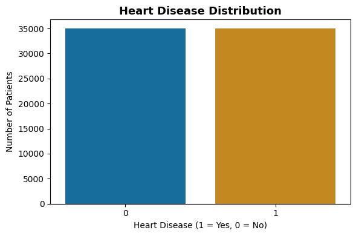
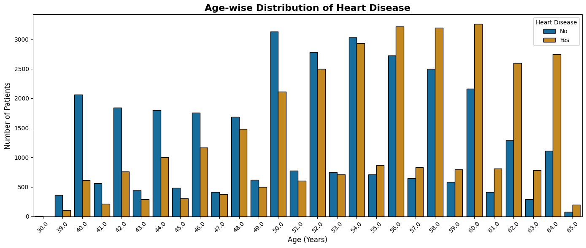
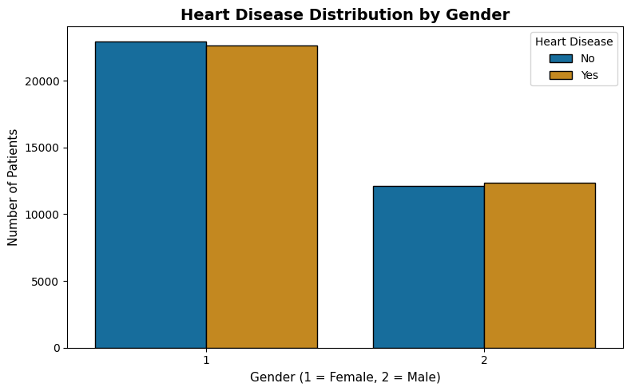
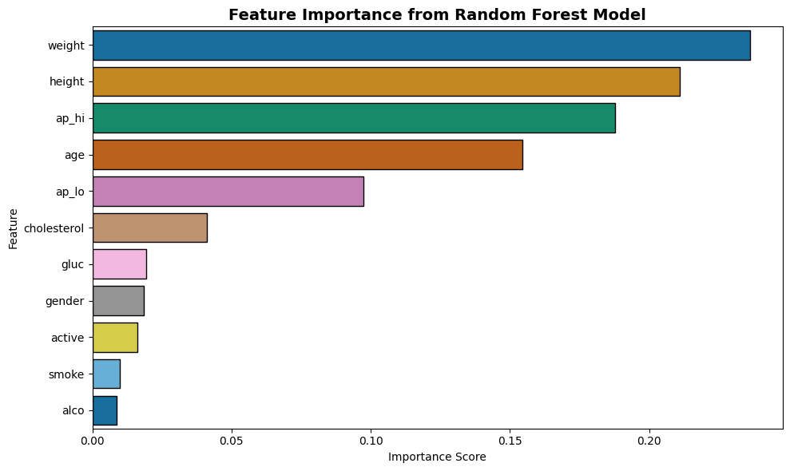

# Predicting Heart Disease Using Random Forest

A machine learning project that predicts the presence of cardiovascular disease using patient medical data.  
The model is built using **Random Forest**, focusing on accuracy, interpretability, and real-world healthcare relevance.

---

## 📌 Project Motivation
Cardiovascular disease is one of the leading causes of death worldwide.  
Early prediction using machine learning can help in preventive care and timely medical intervention.

This project aims to build a reliable ML model that predicts whether a patient is likely to have heart disease based on clinical and lifestyle features.

---

## 📊 Dataset Information
- **Dataset Name:** Cardiovascular Disease Dataset  
- **Source:** Kaggle  
  https://www.kaggle.com/sulianova/cardiovascular-disease-dataset
- **Total Records:** 70,000
- **Target Variable:**  
  - `cardio = 1` → Heart disease present  
  - `cardio = 0` → No heart disease

### 🧹 Data Preprocessing
- Removed irrelevant column (`id`)
- Converted age from **days to years**
- Handled numerical and categorical features
- Prepared data for supervised learning

---

## 🔍 Exploratory Data Analysis (EDA)

### 🫀 Heart Disease Distribution
Shows the proportion of patients with and without cardiovascular disease.

---

### 📈 Age vs Heart Disease
Illustrates how the likelihood of heart disease increases with age.

---

### 🚻 Gender vs Heart Disease
Compares heart disease prevalence between male and female patients.

---

## 🤖 Machine Learning Model

### 🔹 Algorithm Used
- **Random Forest Classifier**

### 🔹 Why Random Forest?
- Handles non-linear relationships effectively  
- Reduces overfitting through ensemble learning  
- Works well with mixed feature types  
- Provides feature importance for interpretability  

---

## 🌟 Feature Importance
The Random Forest model highlights which features contribute most to heart disease prediction.

---

## 📈 Model Evaluation
The model was evaluated using:
- Confusion Matrix
- Classification Report

### 📌 Metrics Considered
- Accuracy
- Precision
- Recall
- F1-Score

The model demonstrates strong predictive performance and balances both false positives and false negatives effectively.

---

## 🛠️ Technologies Used
- **Programming Language:** Python  
- **Libraries:**
  - Pandas
  - NumPy
  - Matplotlib
  - Seaborn
  - Scikit-learn

---

